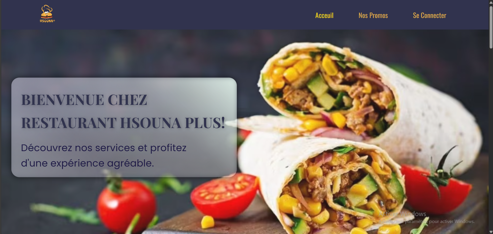

# Hsouna+

## Getting Started
This project is a simple fast food ordering website powered by Angular 17 on the frontend.

## About This Project
Hsouna_Plus allows users to:

- Browse a dynamic food menu (burgers, drinks, desserts, etc.)

- View current promotions on a dedicated page

- Add items to their shopping cart

- Fill out a delivery form (name, address, phone) to place orders

- Use a check-in feature for in-restaurant service or takeaway

- Enjoy a modern, responsive UI optimized for desktop and mobile
This project showcases a lightweight and user-friendly fast food e-commerce interface.

# Setting the project

This project was generated with [Angular CLI](https://github.com/angular/angular-cli) version 16.1.0.

## Prerequisites
 - Install Node.js which includes Node Package Manager (20.10.0)
 - npm install -g @angular/cli
 - Install JDK 17 and Java 17

##  Development Setup
### Change directory (cd ) to frontend folder and :
 -Run npm install
 -Run ng serve for a dev server. Navigate to http://localhost:4200/. The application will automatically reload if you change any of the source files.

